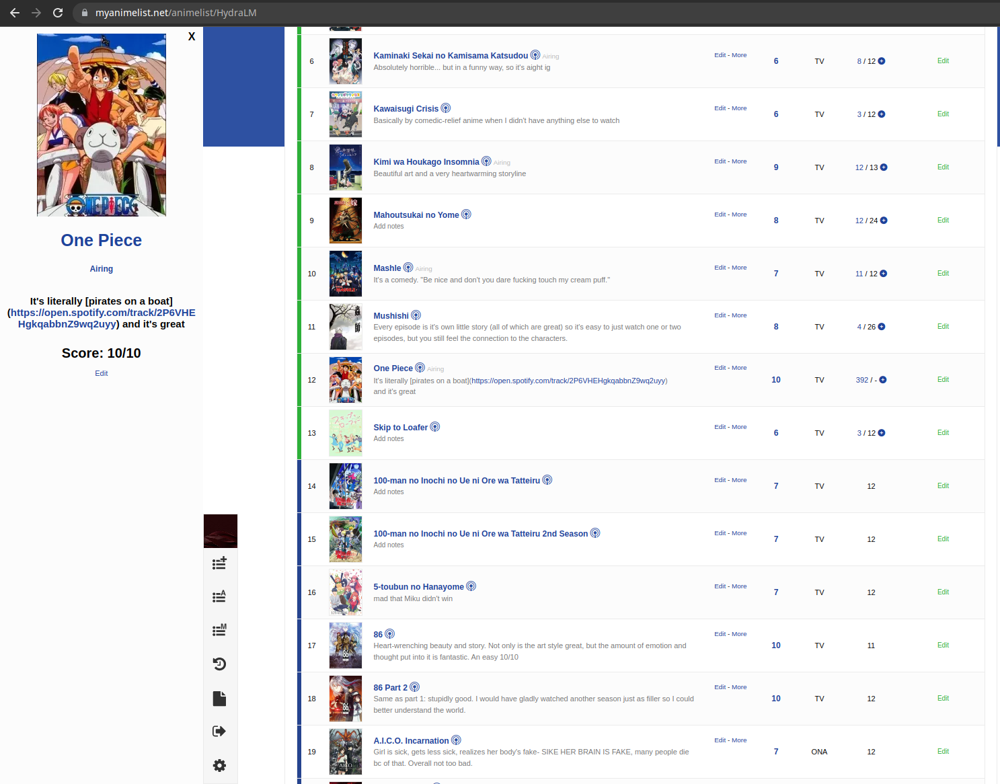

# MAL-sidebar-extension

## What is this?

The sidebar extension is a browser extension designed to enhance the functionality of the MyAnimeList (MAL) platform. It adds a sidebar to the MAL anime list webpage, providing users with a more comfortable anime editing experience.

The extension displays important details such as anime title, description, score, status, and anything the user has enabled in their List Preferences in the sidebar, allowing users to quickly access and view this information without leaving the current page. It also enables users to edit and update anime scores directly from the sidebar (Coming soon).

Through the MAL API and webscraping, the extension fetches real-time data from the user's anime list. It integrates somewhat seamlessly with the existing MAL platform, providing users with a streamlined and convenient experience for managing their anime watchlists.

The extension also allows theme-specific customization of the sidebar through both premade themes (coming soon) and through custom CSS provided by the user (coming soon) making the sidebar fit in no matter the user's selected theme. (What makes the sidebar fit in is based off of my personal opinion and what I think might fit in may not look good to the user)

Any features or bugs, contact me at:\
Github: https://github.com/HydraLM81 \
Discord: https://discord.gg/9zYQsGC73v (Server) / hydralm / HydraLM#9022 \
Gmail: hydralm81@gmail.com

